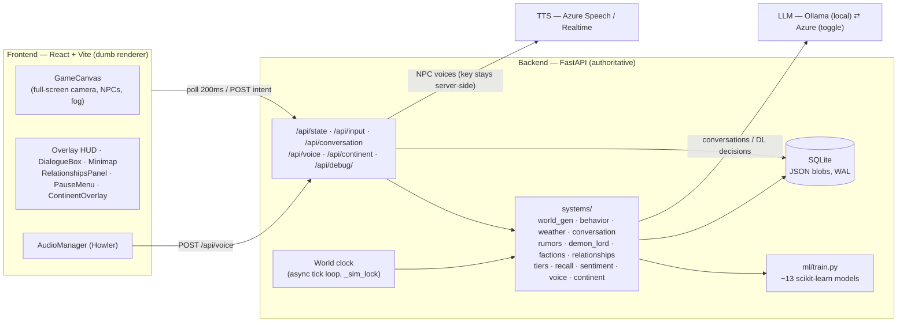

# Chronicle of the Velvet Lies

A **backend-authoritative living-world RPG simulation**. You inherit the life of an
existing villager inside a pre-generated medieval town (**Aldenmoor**) that runs on
its own clock: villagers move, moods shift, weather turns, rumors spread and
distort, factions drift for and against you, and a **Demon Lord** makes one
strategic move each dawn — all driven by ~13 scikit-learn models and a **local
LLM** for in-character conversation. Everything runs **on-device**.

The backend is the single source of truth; the frontend is a **dumb renderer**
that polls a display-ready payload every **200 ms** and paints exactly what it is
told.

> For a presentation-oriented walkthrough see [`../PROJECT_SUMMARY.md`](../PROJECT_SUMMARY.md).
> For full setup steps see [specs/001-living-world-rpg/quickstart.md](specs/001-living-world-rpg/quickstart.md).

---

## Architecture



**The clock (the heart of it).** A background loop advances time independently of
the player. Every real second a movement sub-tick pops cached BFS path steps so
NPCs visibly walk; every Nth tick advances one in-game hour (re-classifying
behavior and re-pathing); at **dawn** a daily tick fires the simulation batch. A
single `_sim_lock` serializes every read-modify-write so the tick, conversations,
and debug writes never tear each other. Slow LLM calls always run *outside* the
lock against snapshots; only applying their results locks.

**Persistence.** SQLite with JSON blobs (WAL so the clock writes while polls
read). The immutable tile grid lives in its own row (`region_static`), written
once, so the hourly save stays lean. Normal play never regenerates the world, so
accumulated NPC memories, conversation history, rumors, and Demon-Lord decisions
survive restarts. (A guarded **Regenerate** in the pause menu wipes the town and
rebuilds it from scratch; the graphical continent is cached separately and kept.)

---

## Features

- **Living town** — ~80 NPCs across 3 simulation tiers and 4 factions, walking,
  working, socializing, and reacting on an autonomous day/night + weather clock.
- **Local-LLM conversations** — click a villager (or press **E**) to talk; replies
  are grounded in the NPC's persona, mood, disposition, **RAG-retrieved memories**,
  and known rumors. Sentiment and memory **persist** across conversations.
- **Emergent narrative** — a Demon Lord makes a schema-constrained decision each
  dawn that erodes faction morale and seeds fear; rumors propagate along the social
  graph and **distort** as they spread.
- **Dynamic personhood ("LRU of personhood")** — talk to a background villager
  enough and they're **promoted** to a deeply-simulated, LLM-enriched character;
  the least-recently-visited Tier-1 is demoted to hold the budget (keeping all
  memories, so returning re-promotes them).
- **Fog of war** + an **ML-generated continent map** (press **M**) rendered as an
  aged atlas — the same biome model that classified the valley classified the
  continent; KMeans draws the nations.
- **Audio** — a day/night original soundtrack, weather/diurnal ambience, footsteps,
  and backend-mediated **NPC voices** (Azure Speech / Realtime). Every audio asset
  degrades gracefully (a missing clip simply no-ops).
- **AA pixel-art UI** — full-screen camera, a diegetic framed HUD, a village
  minimap, an Acquaintances panel, themed pause-menu settings, and a title splash.

---

## The ML layer

13 of a planned 14 scikit-learn models, all trained in-process on synthetic data.
House pattern: a ground-truth **rule** → synthetic samples labelled by it → a
fitted **model** → **predict-with-rule-fallback** (so it degrades to the rule if
scikit-learn is unavailable).

| Model | Trigger | Job |
|---|---|---|
| Biome KMeans | world / continent gen | classify climate cells into biomes |
| Civilization-seed tree | world / continent gen | score tile settlement suitability |
| Weather tree | dawn | next day's weather |
| Behavior tree | hourly | what each NPC does now (7 states) |
| Mood tree | dawn | roll each NPC's mood forward |
| Conversation sentiment | per reply | score the player's tone → disposition shift |
| Tile-interaction scorer | hourly | choose an NPC's destination kind |
| Witness memory tagger | on events | which NPCs witness (and remember) an event |
| Rumor propagation + distortion | dawn | per-hop spread probability + mutation |
| NPC relationship drift | dawn | evolve the Tier-1 social graph |
| Player-reputation scorer | dawn | faction standing tracks the player |
| Faction-relationship updater | dawn | inter-faction relations |
| Country-property generator (random forest) | continent gen | correlated nation stats |

Plus **RAG memory retrieval** (TF-IDF + cosine similarity) to inject the *relevant*
memories into a conversation, not just the most recent.

---

## Conversation (LLM)

Tier-1 NPCs converse via an LLM; the model writes **only the in-character reply**,
while mood, sentiment delta, and memory are computed cheaply backend-side (faster
and more robust than asking the model for JSON). Replies are grounded in
RAG-retrieved memories and known rumors; Tier-2/3 NPCs (and any outage) use
rule-based stub replies.

**Two providers, one toggle.** Local **Ollama** (e.g. `qwen2.5:3b-instruct` for
quality, `qwen2.5:1.5b-instruct` for speed, or `qwen3:4b`) or **Azure** — switched
live from the pause-menu Debug tab, which also shows the active provider and the
last reply's latency. On CPU, Ollama **prompt prefix-cache warming** (on
dialogue-open and after each reply) keeps warm turns at ~4–6 s.

---

## Running it

**Prerequisites:** Python 3.12+, Node 18+, and (for conversation) [Ollama](https://ollama.com)
with a Qwen model pulled. Without Ollama, NPCs fall back to stub replies and
everything else still runs.

**1. Backend**
```bash
cd chronicle/backend
python -m venv .venv
.venv/Scripts/pip install -r requirements.txt          # Windows
# source .venv/bin/activate && pip install -r requirements.txt   # macOS/Linux
.venv/Scripts/python -m uvicorn main:app --port 8000
```

**2. Frontend** (in a second terminal)
```bash
cd chronicle/frontend
npm install
npm run dev          # http://localhost:5173 (proxies /api to 127.0.0.1:8000)
```

**3. LLM (optional but recommended)**
```bash
ollama pull qwen2.5:3b-instruct   # or qwen3:4b
```

**4. Assets** — sprite/audio/font binaries are gitignored and reproduced from the
asset packs at the repo root:
```bash
cd chronicle
uv run --with pillow python backend/tools/setup_assets.py
```
This encodes exactly which pack sprite/track/font becomes which asset, then
crops/copies them. Missing sources are skipped (the renderer/audio no-op on absent
assets), so the app still runs — it just looks/sounds plainer.

**5. NPC voices (optional)** — set `TTS_ENDPOINT` + `TTS_KEY` (Azure Speech or
Azure OpenAI Realtime) in `chronicle/.env`. Absent, NPCs are silent and everything
else works.

**Tests**
```bash
cd chronicle/backend && .venv/Scripts/python -m pytest      # 200+ backend tests
```

> Note: run a **single** uvicorn process (no `--reload` for demos) — two processes
> means two clock loops fighting over the shared SQLite clock. Restart the backend
> after code changes so it serves the new payload.

---

## Controls

| Key / action | Effect |
|---|---|
| Arrow keys | Walk around |
| Click a villager / **E** | Talk (E targets whoever is in front of you) |
| **M** | Continent map overlay |
| **R** | Toggle fog of war |
| **B** | Reveal building interiors |
| **F** | Toggle fullscreen |
| **P** | Pause / resume the world clock |
| **Esc** | Open / close the pause menu |

---

## Project layout
```
chronicle/
  backend/   FastAPI app, SQLite, systems/, ml/, models/, tests/, tools/
  frontend/  React + Vite — GameCanvas, HUD, Minimap, RelationshipsPanel,
             DialogueBox, ContinentOverlay, PauseMenu, AudioPanel, DebugPanel,
             TitleSplash, audio.js, sprites.js, theme.js/theme.css
  specs/     Spec Kit: spec.md, plan.md, tasks.md, data-model.md, quickstart.md
```

## Credits

- Music by **Ivan Duch**.
- Art from the Pixel Crawler, The Fan-tasy Tileset, and Kenney medieval-RTS packs.
- Built with **Spec-Kit** spec-driven development, day by day.
