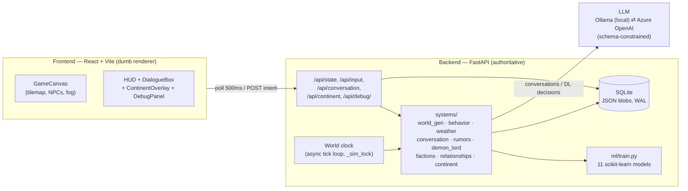

# Chronicle of the Velvet Lies

A **backend-authoritative living-world RPG simulation**. You begin as an existing
NPC inside a pre-generated medieval town (Aldenmoor) that runs on its own clock:
villagers move, moods shift, weather turns, rumors spread and distort, factions
drift for and against you, and a Demon Lord makes one strategic move each dawn —
all driven by a small fleet of scikit-learn models and a local (or cloud) LLM for
in-character conversation.

The backend is the single source of truth; the frontend is a dumb renderer that
polls a display-ready payload every 500ms and paints exactly what it is told.

---

## Architecture



**The clock (the heart of it).** A background loop advances time independently of
the player. Every real second a movement sub-tick pops cached path steps so NPCs
visibly walk; every Nth tick advances one in-game hour (re-classifying behavior
and re-pathing); at **dawn** a daily tick fires the simulation batch. A single
`_sim_lock` serializes every read-modify-write so the tick, conversations, and
debug writes never tear each other. Slow LLM calls always run *outside* the lock
against snapshots; only applying their results locks.

**Persistence.** SQLite with JSON blobs (WAL so the clock writes while polls
read). The immutable tile grid lives in its own row (`region_static`), written
once, so the hourly save stays lean. The world is **never regenerated** — every
system injects/augments in place, so accumulated NPC memories, conversation
history, rumors, and Demon-Lord decisions survive restarts.

---

## What runs each dawn (the ML batch)

In order, under the lock: **NPC relationship drift → rumor propagation +
distortion → player-reputation scorer → faction-relationship updater**, then the
Demon Lord's async decision. Each is a fast scikit-learn predict with a rule
fallback (the house pattern: a ground-truth rule → synthetic samples labelled by
it → a fitted model → predict-with-fallback).

### ML registry (11 models)
| Model | Trigger | Job |
|---|---|---|
| Biome KMeans | world gen | classify the region's climate |
| Civilization-seed tree | world gen | score tile settlement suitability |
| Weather tree | dawn | next day's weather (CDF-as-feature) |
| Behavior tree | hourly | what each NPC does now (7 states) |
| Mood tree | dawn | roll each NPC's mood forward |
| Conversation-mood arbiter | per reply | validate the LLM's proposed mood |
| Country Property Generator | continent gen | correlated nation stats (map tooltips) |
| Rumor Propagation | dawn | per-hop spread probability + distortion |
| NPC Relationship Drift | dawn | unfreeze the Tier-1 social graph |
| Player Reputation Scorer | dawn | faction standing tracks the player |
| Faction Relationship Updater | dawn | inter-faction relations ("Political Stability" at town scale) |

Remaining registry items (Tile Interaction Scorer, Witness Memory Tagger) are
Day-8 work; the two nation-scale models (Political Stability, Economic Flow) are an
honest roadmap item since the continent is visual-only.

---

## Conversation (LLM)

Tier-1 NPCs converse via an LLM; the call returns a JSON card-delta (reply, mood,
sentiment shift, a remembered line). The output is **schema-constrained** so the
model can't drop a field or invent a mood; a salvage/retry net catches the rest;
Tier-2/3 NPCs (and any outage) use rule-based stub replies.

**Two providers, one toggle.** Local **Ollama** (`qwen2.5:1.5b-instruct` for
speed, `qwen2.5:3b-instruct` for quality, `qwen3:4b` for top quality) or **Azure
OpenAI** — switched live from the HUD. The HUD shows the active provider and the
last reply's latency, so you can compare local-vs-cloud speed on stage.

---

## Demo flow (≈10 minutes)

1. **A living town.** Open the app; NPCs are already walking, weather and the
   day/night cycle are turning, the HUD shows the clock and factions. Nobody is
   driving it.
2. **Fog of war.** Only a generous radius around your host NPC is lit; walk
   toward the **NE corner** to discover the Demon Lord's lair (starts black).
   `R` toggles reveal-all.
3. **Conversation + memory.** Click a *fresh* Tier-1 NPC (e.g. a merchant), talk
   twice — it stays in character and remembers. Flip the **LLM toggle** to Azure
   for a fast, polished exchange and to make the local-vs-cloud point.
4. **The continent.** Press **M** for the wider world map (biomes, countries,
   rivers, "you are here") — graphical framing; only Aldenmoor is deeply
   simulated. Hover a country for its correlated stats.
5. **The simulation reacting (the ML payoff).** Open **Debug controls**: talk
   warmly/coldly to a faction's NPCs, then **Trigger dawn** and watch that
   faction's reputation move, relationships drift, and rumors spread/distort —
   the ML batch firing on cue instead of waiting ~6 real minutes.
6. **The antagonist.** Point out the Demon Lord's daily decisions and the faction
   **morale** they erode (distinct from your standing).

**Honest framing:** the local model is tiny (1.5B) for offline responsiveness, so
it occasionally reads stiff — a deliberate speed/quality trade you can showcase by
flipping to the cloud model.

---

## Running it

See [specs/001-living-world-rpg/quickstart.md](specs/001-living-world-rpg/quickstart.md)
for full steps. In short: start the backend (`uvicorn main:app --port 8000`),
start the frontend (`npm run dev`), open `http://localhost:5173`. A local Ollama
with a `qwen2.5`/`qwen3` model is needed for conversation; without it, NPCs fall
back to stub replies and everything else still runs. Azure is optional (set the
`AZURE_OPENAI_*` vars in `chronicle/.env`).

**Assets.** Sprite PNGs are gitignored. The curated Day-8 set (building/decoration/
door sprites + the kenney road spritesheet) is reproduced from the asset packs at
the repo root by `uv run --with pillow python backend/tools/setup_assets.py` — it
encodes exactly which pack sprite becomes which asset, then crops/trims them. Run
it once after cloning (or any time the local assets are lost); a freshly generated
world then looks identical out of the box. The render atlases, the occupation→
sprite map, and the decoration/road generators all live in code, so they apply to
any world automatically — only a world's *simulation* state (NPC memories,
factions, rumors, fog) is lost on regeneration.

Tests: `cd backend && .venv/Scripts/python.exe -m pytest` (135 passing).

## Project layout
```
chronicle/
  backend/   FastAPI app, SQLite, systems/, ml/, models/, tests/
  frontend/  React + Vite (GameCanvas, HUD, DialogueBox, ContinentOverlay, DebugPanel)
  specs/     Spec Kit: spec.md, plan.md, tasks.md, data-model.md, quickstart.md
```
